import { TwitterTweetEmbed } from 'react-twitter-embed';

# Chapter 1

## Building Abstractions with Procedures

intro:

> <b>“Pessoas criam programas para direcionar processos”</b>

<TwitterTweetEmbed
  tweetId={'1541520630474063873'}
/>

<TwitterTweetEmbed
tweetId={'1542131873140318208'}
/>

<TwitterTweetEmbed
tweetId={'1542132956420005889'}
/>

### Programming in Lisp:

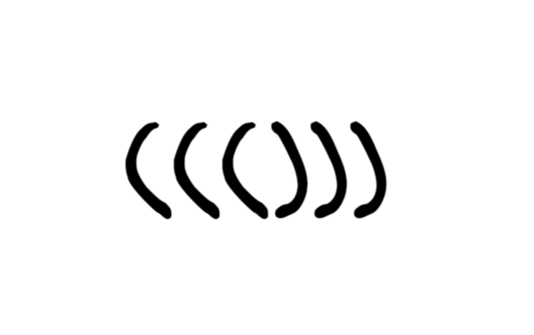

> <b>“uma linguagem apropriada para descrever processos”</b>

Lisp tem sua origem matemática

Lisp foi projetada para fornecer recursos de manipulação de símbolos para atacar problemas de programação, como diferenciação simbólica e integração de expressões algébricas. Incluía para esse propósito novos objetos de dados conhecidos como **átomos** e **listas**. que o diferenciavam de maneira mais marcante de toadas as outras linguagens do período.

Lisp a segunda linguagem mais antiga em uso atualmente

Assim Lisp agora é uma família de dialetos

## The Elements of Programming

intro:

Uma linguagem de programação poderosa é mais do que apenas um meio de instruir um computador a executar tarefas. A linguagem também serve como uma estrutura dentro da qual organizamos nossas ideias sobre processos. Assim , quando descrevemos uma linguagem, devemos prestar atenção especial aos meios de linguagem fornecidas para combinar ideias simples para formar ideias mais complexas. Toda linguagem poderosa tem três mecanismos para realizar isso:

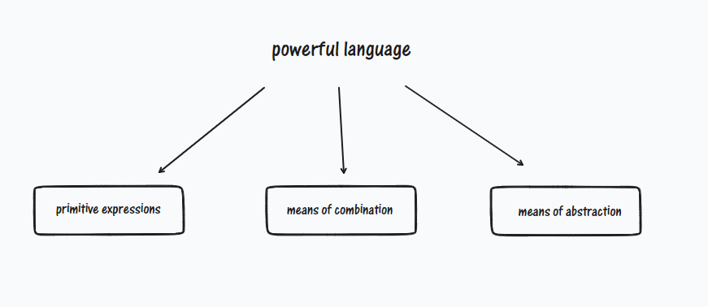

- **expressões primitivas:** que representam as entidades mais simples com as quais a linguagem está preocupada;
- **meio de combinação:** pela qual os elementos compostos são construídos a partir do mais simples;
- **meio de abstração:** pela qual os elementos compostos podem ser nomeados e manipulados como unidades.

**Elementos**:

- Procedimentos: são descrições das regras para manipular os dados
- Dados: são “coisas” que queremos manipular

“Assim, qualquer linguagem de programação poderosa deve ser capaz de descrever dados primitivos e procedimentos primitivos e deve ter métodos para combinar e abstrair procedimentos e dados.”

### Expressions

Expressão = manifestação do pensamento por meio da palavra ou do gesto

1- Uma expressão primitiva pode ser representada por números

2- Essa expressão primitiva de números pode vir acompanhada de um procedimento primitivo como ( + ou \* ), o que em conjunto se torna uma expressão composta

3- O que resulta em em uma aplicação de um procedimento para com esses números

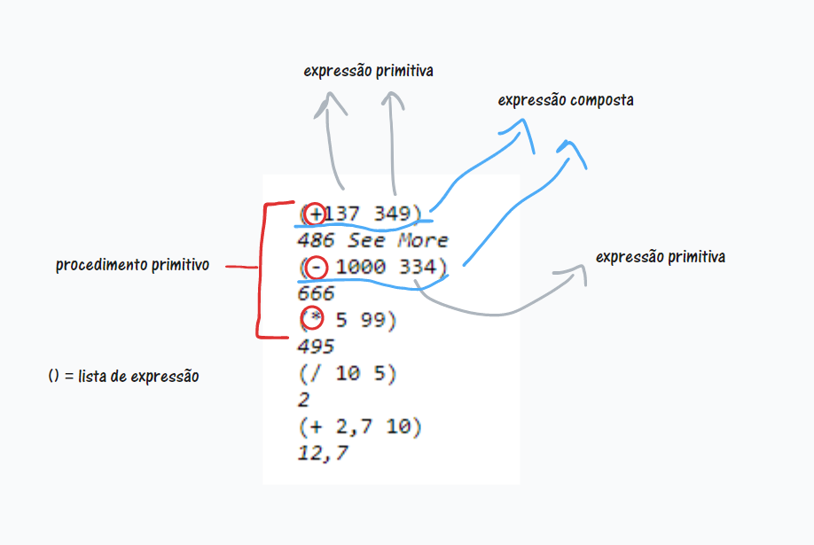

4- Observe que há uma delimitação de expressões por (), o que é chamado de lista de expressões formando um procedimento

- notação de prefixo ( operador à esquerda dos operandos)

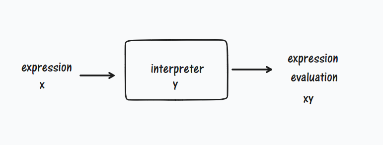

- Loop de leitura → avaliação → impressão

### Naming and the Environment

Um aspecto crítico de uma linguagem de programação são os meios que ela fornece para usar nomes para se referir a objetos computacionais. Dizemos que um nome identifica uma “variável” cujo o “valor” é um objeto

Scheme Lisp:

Para determinar nomes é usado o **‘’define’’**

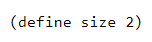

Faz com que o interpretador associe o valor 2 ao nome size. Uma vez associado o tamanho do nome ao número 2, podemos nos referir ao valor 2 pelo nome:

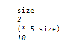

mais exemplos

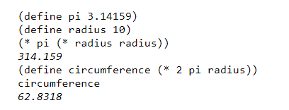

- “define” é o meio de abstração mais simples da linguagem, pois nos permite usar nomes simples para nos referir aos resultados de operações compostas
- Lisp geralmente consiste em um grande número de procedimentos relativamente simples

### Evaluating Combinations

- Para avaliar uma combinação:

1- Avalie as sub expressões da combinação

2- Aplique o procedimento que é o valor da sub expressão mais à esquerda (o operador) aos argumentos que são valores das outras sub expressões ( os operandos)

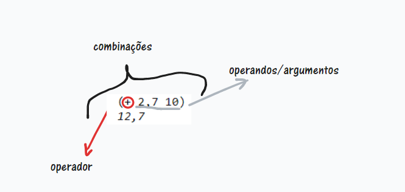

- A regra de avaliação ( a primeira ) é de natureza recursiva, pois para realizar a próxima regra é necessário invocar a própria regra

Em geral, veremos que a recursão é uma técnica muito poderosa para lidar com objetos hierárquicos em forma de árvore. De fato, a forma “percolate values upward” da regra de avaliação é um exemplo de um tipo geral de processo conhecido como *tree accumulation* .

- Visualização de uma avaliação em termos de árvore:

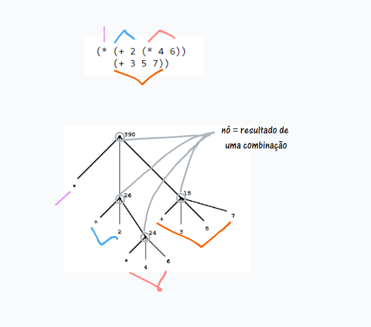

- Representação em árvore, mostrando o valor de cada subcombinação acima

- Note que a analise repetida do primeiro passo nos leva ao ponto em que precisamos avaliar, nao so combinacoes,
  mas expressoes primirtivas como numerais, operadores internos ou outros nomes.

Avaliamos os casos primitivos:

- os valores dos numerais sao os numeros que eles nomeiam;

- os valores dos built-in operators(operadores integrados) sao as sequencias de instrucoes de maquina que realizam as operacoes correspondentes

- os valores de outros nomes sao os objetos associados a esses nomes no ambiente.

O ponto principal a ser oservado é a função do ambiente na determinação do significado dos símbolos e expressões.
A noção geral de que o ambiente fornece um contexto no qual a avaliação ocorre desempenhará um papael importante na nossa
compreensão de como ocorre a execução de um programa.

Tais exceções à regra geral de avaliação são chamadas de special forms (formulários especiais). define é o único exemplo de formulário
especial que vimos até agora, mas conheceremos outros em breve. Cada formulário especial possui sua própria regra de avaliação. Os vários tipos de
expressões (cada uma com sua regra de avaliação associada) constituem a sintaxe da linguagem de programação. Em comparação com a maioria das outras
linguagens de programação, Lisp possui uma sintaxe muito simples; isto é, a regra de avaliação para expressões pode ser descrita por uma regra geral
simples juntamente com regras especializadas para um pequeno número de formas especiais.

### Compound Procedures (Procedimentos Compostos)
Notamos em Lisp alguns dos elementos base para uma linguagem ser poderosa/eficiente:

- Números e operações aritméticas são dados e procedimentos primitivos.

- O aninhamento de combinações fornece um meio de combinar operações.

- As definições que associam nomes a valores fornecem um meio limitado de abstração.

Agora aprenderemos sobre definições de procedimentos, uma técnica de abstração muito mais poderosa pela qual uma operação composta pode receber um nome e depois ser chamada de unidade.

Começamos examinando como expressar a ideia de “elevar ao quadrado”. Poderíamos dizer: “Para elevar ao quadrado algo, multiplique-o por ele mesmo”. Isso é expresso em nossa linguagem como:

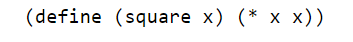

Temos aqui um procedimento composto, ao qual foi dado o nome de quadrado. O procedimento representa a operação de multiplicar algo por si mesmo. À coisa a ser multiplicada é dado um nome local, x, que desempenha o mesmo papel que um pronome desempenha na linguagem natural. A avaliação da definição cria este procedimento 
composto e o associa ao nome quadrado.

A forma geral de uma definição de procedimento é:

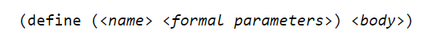
