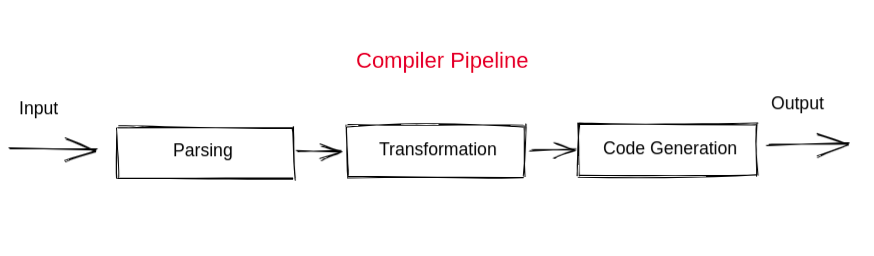

<h1 align="center">
Criando um simples programa em C
</h1>

*link utilizado para estudo* http://www.toves.org/books/cpy/

<h2>Compiladores vs Interpretadores</h2>

* Uma grande diferença entre C e Python é como você executa programas escritos nas duas linguagens. Com programas C, você geralmente usa um **compilador** para ver um programa ser executado. Em contrapartida com o Python, você normalmente usa um **interpretador**

* Um **compilador** gera um arquivo contendo a tradução do programa para código nativo da máquina. O compilador não executa realmente o programa, você executa primeiro o compilador para criar um executável nativo e, em seguida, executa o arquivo gerado. Logo, depois da criação de um programa em C, sua execução é um processo de duas etapas:

*Uma visão aprofundada sobre compiladores*

<p align="center">
    
</p>

* Assim depois de criar um programa qualquer em C :
```c

#include <stdio.h>

int main () {
    printf ("Ola mundo!\n");
    return 0;
}

```
* Irá executar em duas etapas:
```bash

sh:~$ gcc myprogram.c -o myprogram
sh:~$ ./myprogram
Hello World!

```